# Tutorial #2: Real-time IoT data processing with Cloud Functions and Cloud Dataflow/Apache Beam

The setup described in this tutorial addresses following scenario: 

At industrial facilities, sensors are installed to monitor the equipment on site. Sensor data is continuously streamed to the cloud. There it is handled by different components for various purposes, such as real-time monitoring and alerts, long-term data storage for analysis, performance improvement, and model training.

In this tutorial, you will build on top of the previous [tutorial #1](https://github.com/kenly-ldk/gcp-iot-demo/tree/master/connectivity), where we already setup a gateway that manages a Raspberry Pi device. The accelerometer data from Sense Hat attached to the Raspberry Pi device is continuously generated, and they are delivered to the cloud for real-time processing.
<hr/>

## Technical Overview
This tutorial demonstrates how to push updates from Message Queueing Telemetry Transport (MQTT) devices to Google Cloud Platform (GCP) and process them in real time.

The tutorial includes sample code to show two kinds of data processing approaches that use GCP products:
1. A function deployed in Cloud Functions transforms data and logs it to Stackdriver Logging.
2. A streaming application deployed in Cloud Dataflow transforms data and inserts it into BigQuery.
<hr/>

## Architecture
The following diagram gives a high-level overview of how device data is ingested into Cloud IoT Core, and Cloud PubSub, before they are retrieved by two subscribers: a function in Cloud Functions and a streaming job running in Cloud Dataflow.
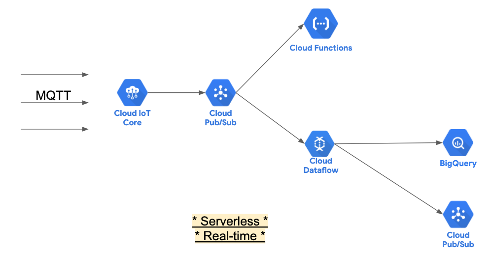
<hr/>

## Costs
This tutorial uses billable components of GCP, including:
- BigQuery
- Cloud Dataflow
- Cloud Functions
- Cloud IoT Core
- Cloud Pub/Sub
- Cloud Storage
- Compute Engine

This tutorial should not generate any usage that would not be covered by the free tier, but you can use the [pricing calculator](https://cloud.google.com/products/calculator) to generate a cost estimate based on your projected usage.
<hr/>

## Data structure
The Raspberry Pi device equipped with Sense Hat will generate data having the following attributes:
- DeviceId: A unique identifier for individual devices.
- Timestamp: A timestamp for when a temperature is measured.
- Accelerometer: The measured amount of G-force acting on each axis (x, y, z). If any axis has ±1G, then you know that axis is pointing downwards.
<hr/>

## Initiate the gateway and the device program
1. In this tutorial, you'll use a Raspberry Pi that is equipped with a [Sense HAT](https://www.raspberrypi.org/products/sense-hat/) . We will be capturing and sending the [accelerometer data](https://projects.raspberrypi.org/en/projects/getting-started-with-the-sense-hat/8) from the Sense Hat in real-time to the cloud for processing.
2. Make sure you have completed the previous tutorial to have the device connected to the cloud via the gateway, and it is able to publish data successfully
3. Start the gateway program from the laptop/desktop terminal
```bash
source run_gateway
```
4. Start the device program from the Raspberry device terminal, this time with v3
```bash
source run_device_v3
```
5. If everything is done correctly, you should see that the device is sending continuous stream of data like the following output
```bash
# Expected log messages from device
...
2020-04-28 13:48:32,102 - INFO - Send data: { "device" : "my-device", "action":"event", "data" : { "device_id": "my-device", "event_time": "Tue Apr 28 13:48:32 2020", "raw_accelerometer_data": "x=0.0, y=-0.0, z=1.0" } } 
2020-04-28 13:48:33,104 - INFO - Send data: { "device" : "my-device", "action":"event", "data" : { "device_id": "my-device", "event_time": "Tue Apr 28 13:48:33 2020", "raw_accelerometer_data": "x=0.0, y=-0.0, z=1.0" } } 
...
```

<hr/>

## Deploy a Cloud Functions
Cloud Functions is designed for event-driven computation. In our setup, for each message that is published from the device and made available in the pubsub subscription, a function will be activated. We have also predefined a condition in the function, if it is met, the function will log a message into Stackdriver.

1. Login to the [GCP Cloud console](https://console.cloud.google.com/).

2. Click the **Activate Cloud Shell** icon in the upper right area of the GCP window.
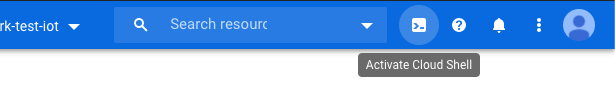

3. In the newly launched Cloud Shell terminal, enter the following:
```bash
git clone https://github.com/kenly-ldk/gcp-iot-demo.git
cd data-processing/cloud-functions
```

4. Navigate to the [Cloud Functions console](https://console.cloud.google.com/functions/list), and Click **Create Function**

5. Enter the **name** for the function, for example, <code><b>detect_x_abnormal</b></code>. Keep the **Memory allocated** as default

6. Under **Trigger**, select <code><b>Cloud Pub/Sub</b></code>, and select the corresponding IoT Hub events PubSub topic <code><b>telemetry-data</b></code>

7. Under **Source Code**, select **Inline editor**, change the **Runtime** to <code><b>Python 3.7</b></code>

8. Then copy the code provided in the local folder <code><b>main.py</b></code>, to replace the content in the console editor

9. Also change the **Function to execute** to match the function name that we just copied <code><b>detect_x_abnormal</b></code>
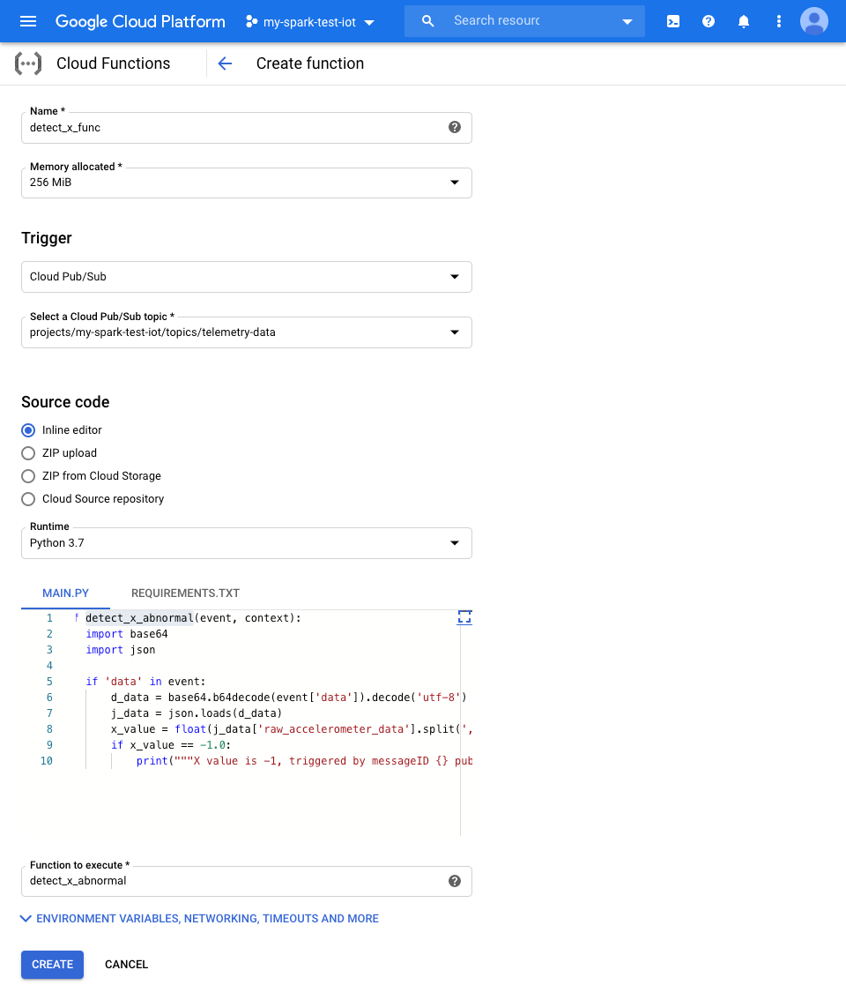

10. Click **Create**

11. Wait for the deployment, and verify that the function has been created successfully with a green status
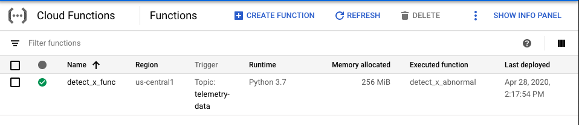

12. If the device is still sending the stream of data, the cloud function is triggered everytime a message is received. Verify by clicking onto the function name, and then click **View Logs**


13. It will take us to **Logs Viewer** of this particular cloud function, we can always click on **Jump To Now** to get the latest log messages
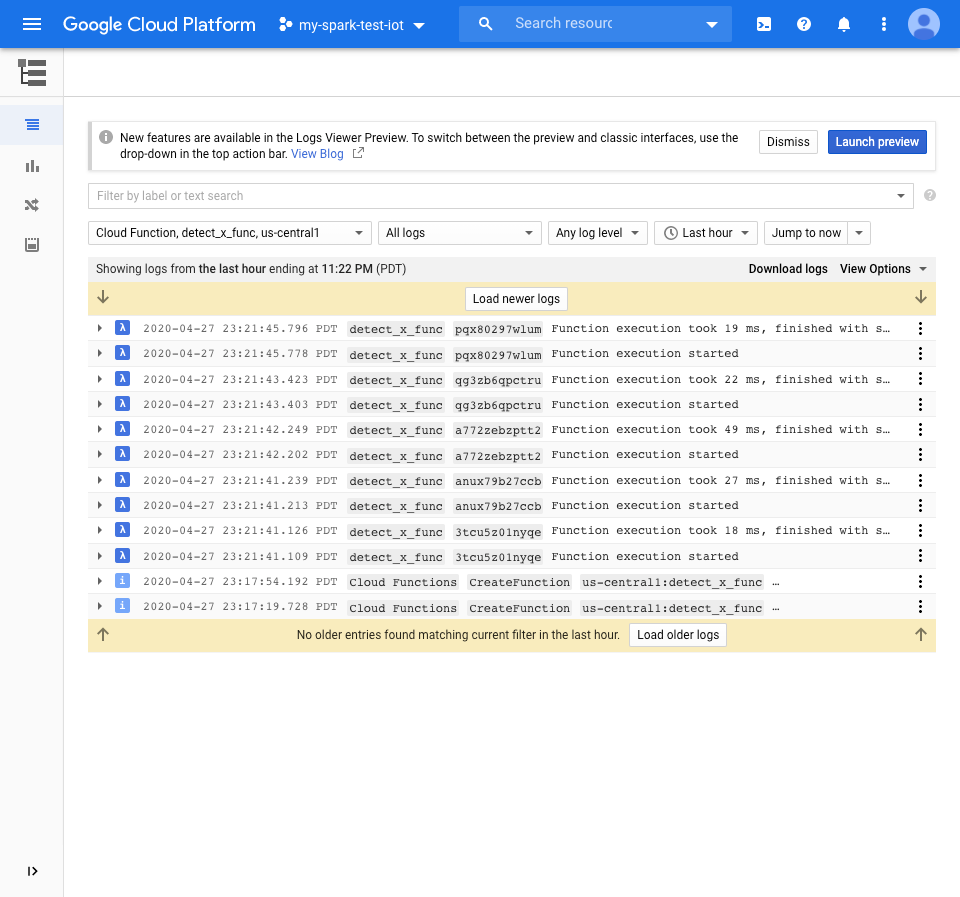

13. Now rotate the Raspberry device (with Sense Hat attached) onto its left edge. The value of X should be <code><b>-1.0</b></code> as seen in the device log program.
```bash
# Expected log messages from device
...
2020-04-28 14:41:19,324 - INFO - Send data: { "device" : "my-device", "action":"event", "data" : { "device_id": "my-device", "event_time": "Tue Apr 28 14:41:19 2020", "raw_accelerometer_data": "x=-1.0, y=0.0, z=0.0" } } 
2020-04-28 14:41:20,299 - INFO - Send data: { "device" : "my-device", "action":"event", "data" : { "device_id": "my-device", "event_time": "Tue Apr 28 14:41:20 2020", "raw_accelerometer_data": "x=-1.0, y=-0.0, z=-0.0" } } 
...
```

14. This published X value of <code><b>-1.0</b></code> will trigger the predefined logic condition in our function, and hence it will log an additional message into Stackdriver.

15. Verify that the alert print message in Stackdriver. We can also search for the specific message by typing in the filter as below:
```text
resource.type="cloud_function"
resource.labels.function_name="detect_x_func"
textPayload:"X value is -1, triggered by messageID"
```
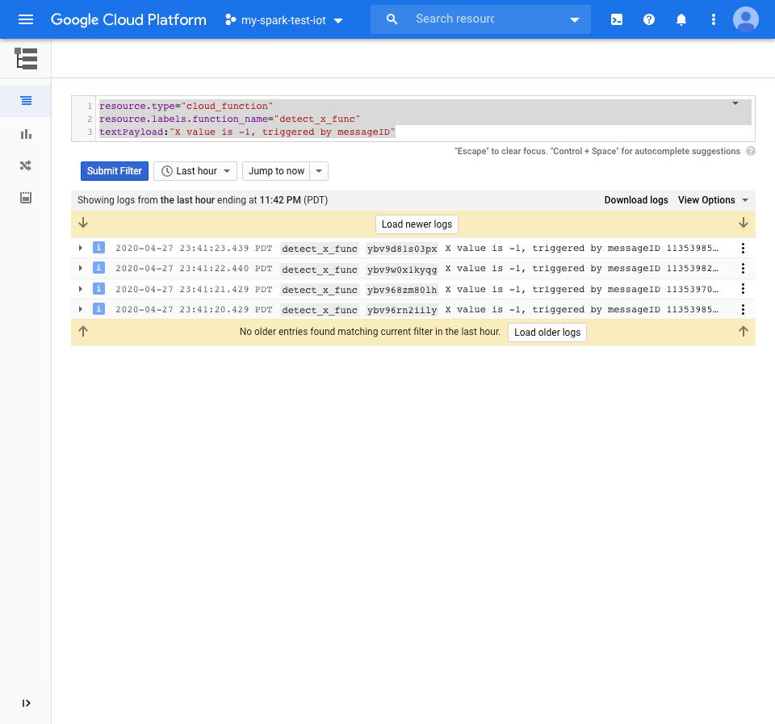

<hr/>

## Deploy a streaming application to Cloud Dataflow to preserve all raw device data to a datawarehouse, using existing ‘PubSub to BigQuery’ template
In this section, we deploy a data pipeline with Cloud Dataflow predefined template that transforms data retrieved from Cloud Pub/Sub and loads it into a BigQuery dataset in real-time.

1. First we need to create the destination [BigQuery](https://cloud.google.com/bigquery) dataset and table. Open the [BigQuery console](https://console.cloud.google.com/bigquery), select your corresponding project id <code><b>my-spark-test-iot</b></code> on the left panel, then click **Create Dataset** on the right panel
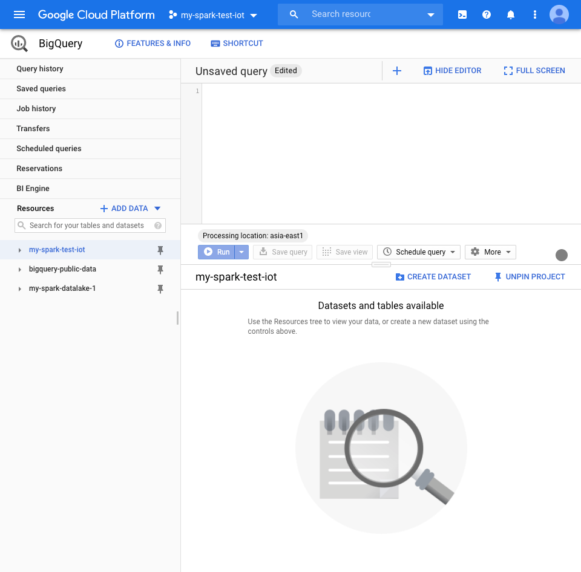

2. Enter the **Dataset ID**, for example, <code><b>telemetry_data_lake</b></code>. And select the **Data location** as <code><b>Taiwan (asia-east1)</b></code>. Keep the rest of the default values, and click **Create Dataset**
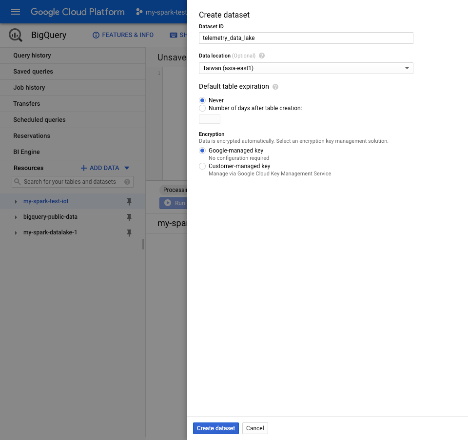

3. Next select the newly created dataset <code><b>telemetry_data_lake</b></code> on the left panel, then click **Create Table** on the right panel
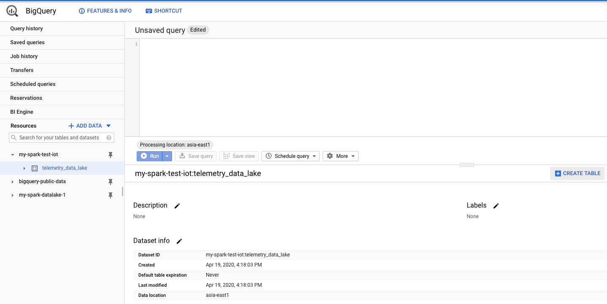

4. Keep most the values as default. Enter the **Table Name**, for example, <code><b>telemetry_data_raw</b></code>. Under **Schema**, create 3 fields <code><b>device_id</b></code>, <code><b>event_time</b></code>, <code><b>raw_accelerometer_data</b></code> as following. Create **Create table**
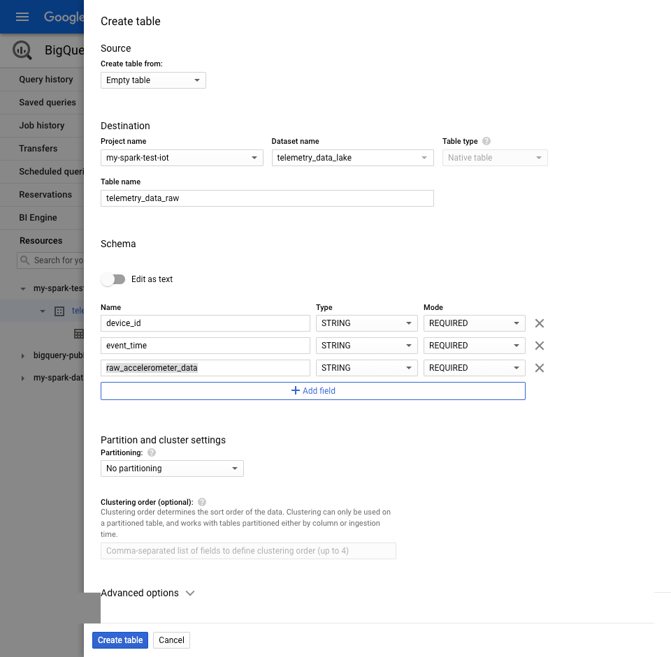

5. Next we also have to create a staging [Cloud Storage](https://cloud.google.com/storage) bucket named <code><b>my-spark-test-iot-bucket</b></code> for dataflow job to save the intermediate artifacts when executing the job. From Cloud Shell terminal, execute the following:
```bash
gsutil mb -l asia-east1 -b on gs://my-spark-test-iot-bucket
```

6. Now we are ready for creating the [Cloud Dataflow](https://cloud.google.com/dataflow) job. Open the [Cloud Dataflow console](https://console.cloud.google.com/dataflow).

7. Click **Create Job From Template**

8. Enter the **Job name**, for example, <code><b>my-iot-job-1</b></code>.

9. Select <code><b>asia-east1</b></code> for **Regional endpoint**

10. Under **Cloud Dataflow template**, select <code><b>Cloud Pub/Sub Topic to BigQuery</b></code>

11. In the popped up section, specify the corresponding corresponding IoT Hub events PubSub topic <code><b>projects/my-spark-test-iot/topics/telemetry-data</b></code> (full path is required) for **Cloud Pub/Sub input subscription** 

12. Specify the BigQuery table that we just created <code><b>my-spark-test-iot:telemetry_data_lake.telemetry_data_raw</b></code> (full path is required) for **BigQuery output table** 

13. Specify the temp folder for Cloud Storage that we just created <code><b>gs://my-spark-test-iot-bucket/tmp</b></code> for **Temporary location** 

14. Keep the rest of the default values, and click **Run Job**
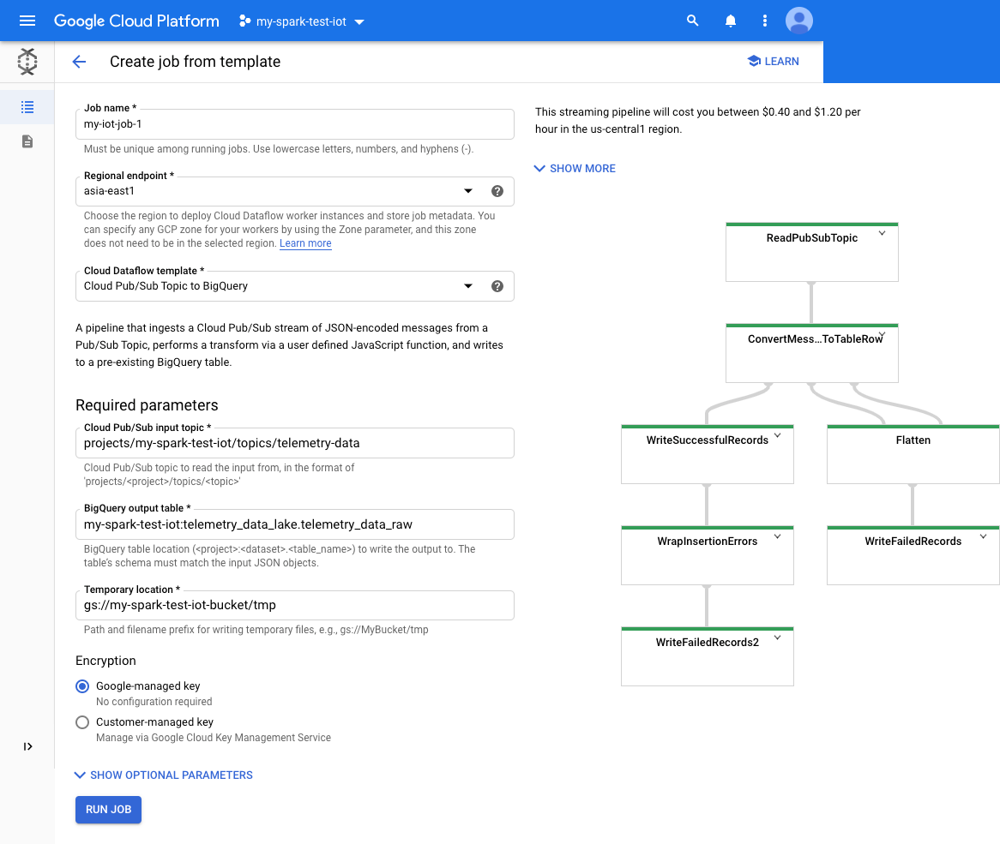

15. If the device is still sending the stream of data, in a few minutes, the Cloud Dataflow job will be scaling up automatically to process the incoming data, and write the results into BigQuery.

16. Click into the name of the Cloud Dataflow job that we just created for visualization
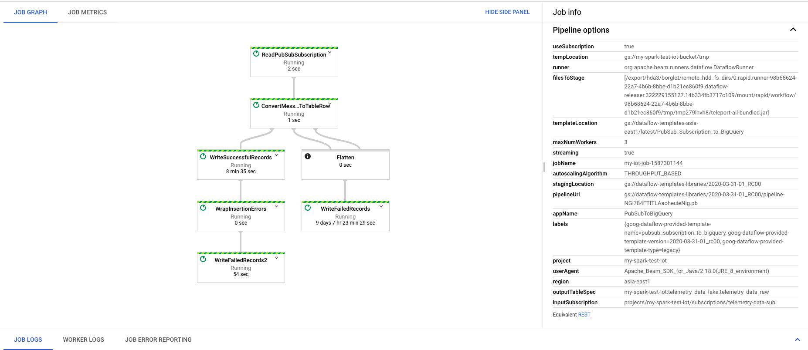

17. We can also visit BigQuery console, and execute a query there to confirm that data is being written to the table
```SQL
SELECT * FROM `telemetry_data_lake.telemetry_data_raw`
WHERE event_time LIKE '%Tue Apr 28%'
```

<hr/>

## Deploy a custom Apache Beam streaming application, with real-time windowing data processing

In this section, we deploy a data pipeline with a custom Python application written in [Apache Beam](https://beam.apache.org/) - an open source unified programming model to define and execute data processing pipelines, including ETL, batch as well as stream processing.

The program will retrieve the same accelerometer telemetry data from Cloud Pub/Sub, and perform a windowing to determine whether the device has been flipped on to its left side (and hence **the value X=-1.0**) for more than **10 seconds**. If such event is detected, it will generate an alert message into another Cloud PubSub topic, ready for further processing.

In this tutorial, we will be running the program from Cloud Shell directly, but it is also possible to deploy this Apache Beam program to Cloud Dataflow as the runtime environment (Example [here](https://cloud.google.com/dataflow/docs/quickstarts/quickstart-python#run-wordcount-on-the-dataflow-service)).

1. From the [Cloud Pub/Sub console](https://console.cloud.google.com/cloudpubsub), create a new subscription named <code><b>telemetry-data-sub-new</b></code> that subscribes to the same Cloud IoT event telemetry topic <code><b>telemetry-data</b></code>

2. Also we will create a new topic named <code><b>x-alert-left</b></code> that will be the destination for the alert message generated by our program, as well as a subscrption named <code><b>x-alert-left-sub</b></code> for this new topic (so that we can retrieve the message later for verification)

3. Then from Cloud Shell terminal, navigate to the following folder as part of the git repo we have downloaded earlier
```bash
cd data-processing/beam
```

4. Execute the following command, with the parameter for the full path of **input_subscription**, and **output_topic** that we just created above
```bash
python processing_to_pubsub.py --input_subscription projects/my-spark-test-iot/subscriptions/telemetry-data-sub-test --output_topic projects/my-spark-test-iot/topics/x-alert-left
```

5. If the device is still sending the stream of data, we will be seeing the output as below, which is processing the incoming x_value of the device in a window of 10 seconds
```bash
...
[Tue Apr 28 15:44:14 2020] 0.0: 1
[Tue Apr 28 15:44:14 2020] 0.0: 2
[Tue Apr 28 15:44:14 2020] 0.0: 3
[Tue Apr 28 15:44:14 2020] 0.0: 4
[Tue Apr 28 15:44:14 2020] 0.0: 5
[Tue Apr 28 15:44:14 2020] 0.0: 6
[Tue Apr 28 15:44:14 2020] 0.0: 7
[Tue Apr 28 15:44:14 2020] 0.0: 8
[Tue Apr 28 15:44:14 2020] 0.0: 9
[Tue Apr 28 15:44:14 2020] 0.0: 10
[Tue Apr 28 15:44:14 2020] 0.0: 9
[Tue Apr 28 15:44:14 2020] 0.0: 8
[Tue Apr 28 15:44:15 2020] 0.0: 10
[Tue Apr 28 15:44:16 2020] 0.0: 10
```

6. Now rotate the Raspberry device (with Sense Hat attached) onto its left edge. The value of X should be <code><b>-1.0</b></code> as seen in the device log program. Let the device sit in this position for **10 seconds**, and continue to observe the output of our program
```bash
[Tue Apr 28 15:44:29 2020] 0.0: 10
[Tue Apr 28 15:44:30 2020] 0.0: 9
[Tue Apr 28 15:44:30 2020] -1.0: 1
[Tue Apr 28 15:44:31 2020] 0.0: 8
[Tue Apr 28 15:44:31 2020] -1.0: 2
[Tue Apr 28 15:44:32 2020] 0.0: 8
[Tue Apr 28 15:44:32 2020] -1.0: 2
[Tue Apr 28 15:44:33 2020] 0.0: 6
[Tue Apr 28 15:44:33 2020] -1.0: 3
[Tue Apr 28 15:44:34 2020] 0.0: 5
[Tue Apr 28 15:44:34 2020] -1.0: 4
[Tue Apr 28 15:44:35 2020] 0.0: 5
[Tue Apr 28 15:44:35 2020] -1.0: 6
[Tue Apr 28 15:44:36 2020] 0.0: 3
[Tue Apr 28 15:44:36 2020] -1.0: 7
[Tue Apr 28 15:44:37 2020] 0.0: 2
[Tue Apr 28 15:44:37 2020] -1.0: 7
[Tue Apr 28 15:44:38 2020] 0.0: 1
[Tue Apr 28 15:44:38 2020] -1.0: 9
[Tue Apr 28 15:44:39 2020] -1.0: 9
[Tue Apr 28 15:44:40 2020] -1.0: 9
[Tue Apr 28 15:44:41 2020] -1.0: 9
[Tue Apr 28 15:44:42 2020] -1.0: 10
```

7. At this point, the program has detected the count of the value <code><b>X=-1.0</b></code> for **10 times**, and according to the logic in the program, it will write a message to the output PubSub topic.

8. Open a separate Cloud Shell terminal, and verify the message in the subscription <code><b>x-alert-left-sub</b></code> that is subscripting to the output topic <code><b>x-alert-left</b></code>
```bash
$ gcloud pubsub subscriptions pull x-alert-left-sub --limit=10
```
<hr/>

## Cleanup
To avoid incurring any future billing costs, it is recommended that you delete your project once you have completed the tutorial.
<hr/>